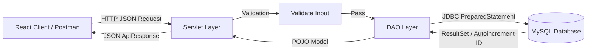

# Smart Library Management System - Backend & Database Foundation

> **AJT (Advanced Java Technology) Mini Project - Stage 1 Implementation**

A robust, enterprise-structured standard Java Servlet web application for the **Smart Library Management System** developed using **Java Servlets**, **JDBC (Java Database Connectivity)**, **MySQL**, and **Apache Tomcat** with **manually managed JAR dependencies** (No Maven, No Spring Boot, No Hibernate).

---

## Table of Contents

1. [Project Overview](#1-project-overview)
2. [Technology Stack](#2-technology-stack)
3. [Database Setup](#3-database-setup)
4. [Project Structure](#4-project-structure)
5. [How to Configure MySQL](#5-how-to-configure-mysql)
6. [How to Run in Eclipse / IntelliJ / Tomcat](#6-how-to-run-in-eclipse--intellij--tomcat)
7. [API Endpoints Documentation](#7-api-endpoints-documentation)
8. [CRUD Operations Breakdown](#8-crud-operations-breakdown)
9. [Exception Handling & Status Codes](#9-exception-handling--status-codes)
10. [Testing with cURL & Postman](#10-testing-with-curl--postman)

---

## 1. Project Overview

The **Smart Library Management System** backend manages physical book inventory, student memberships, book genres/categories, and book issue/return borrowing workflows.

### First Stage Focus (15-Mark Rubric Compliance)
* **Database Creation**: Normalized relational schema with strict foreign keys, check constraints, indexes, and realistic sample data.
* **JDBC Connectivity**: Reusable, centralized connection manager (`DBConnection`) with externalized properties and driver registration.
* **CRUD Operations**: Complete Create, Read, Update, Delete, and multi-field Search operations using `PreparedStatement` and `ResultSet`.
* **Atomic Transactions**: ACID-compliant JDBC transaction management (`setAutoCommit(false)`, `commit()`, `rollback()`) for book borrowing and returns.
* **Exception Handling**: Layered architecture that catches SQLExceptions, prevents raw database exposure, and returns structured JSON responses.
* **CORS Support**: Centralized filter (`CorsFilter`) preconfigured to allow React JS frontend development.

> [!NOTE]
> As specified in the project requirements, **NO fine calculation or overdue fee management** is implemented. Returning a book simply logs the return date, changes status to `RETURNED`, and increments available stock.

---

## 2. Technology Stack

* **Programming Language**: Java 17
* **Web Layer**: Java Servlets (`javax.servlet-api:4.0.1`)
* **Persistence Layer**: JDBC with `PreparedStatement` & `ResultSet`
* **Database**: MySQL 8.0+
* **JSON Processing**: Google Gson 2.10.1
* **Application Server**: Apache Tomcat 9+
* **Architecture Pattern**: Layered MVC/DAO Architecture (Model - DAO - Servlet - Util)
* **Dependency Management**: Manually Managed JARs in `WebContent/WEB-INF/lib/` (No Maven)

---

## 3. Database Setup

### Step 1: Open MySQL Workbench or MySQL CLI
Log in as the root user:
```bash
mysql -u root -p
```

### Step 2: Execute the SQL Script
Run the provided SQL script located at `database/library_management.sql`:
```bash
mysql -u root -p < database/library_management.sql
```
*Or in MySQL Workbench:*
1. Go to **File** > **Open SQL Script...**
2. Select `library-management-backend/database/library_management.sql`.
3. Click the **Execute (⚡ Lightning Bolt)** icon.

### Step 3: Verified Schema & Sample Data
The script will automatically create:
* Database: `library_management`
* Tables: `admin`, `categories`, `books`, `students`, `issued_books`
* Sample records for testing immediately out-of-the-box.

---

## 4. Project Structure (Standard Dynamic Web Project)

```text
library-management-backend/
│
├── build.bat                                  # Windows Build & WAR Packaging Script
├── README.md                                  # Complete Documentation
├── docs/
│   └── database-design.md                     # ER Diagrams & Schema Specs
│
├── database/
│   └── library_management.sql                 # MySQL Schema & Sample Data
│
├── WebContent/                                # Web Application Root
│   └── WEB-INF/
│       ├── web.xml                            # Servlet Declarations, URL Mappings & CORS Filter
│       └── lib/                               # Manually Managed JAR Dependencies
│           ├── gson-2.10.1.jar                # Google Gson JSON Library
│           ├── javax.servlet-api-4.0.1.jar    # Servlet 4.0 API
│           └── mysql-connector-j-8.0.33.jar   # MySQL JDBC Driver
│
└── src/
    ├── db.properties                          # Centralized Database Configuration
    └── com/
        └── library/
            ├── exception/                     # Custom Domain Exceptions
            │   ├── DatabaseException.java
            │   ├── ResourceNotFoundException.java
            │   └── ValidationException.java
            │
            ├── model/                         # POJO Data Models
            │   ├── Book.java
            │   ├── Category.java
            │   ├── IssuedBook.java
            │   └── Student.java
            │
            ├── dao/                           # JDBC Data Access Objects
            │   ├── BookDAO.java
            │   ├── CategoryDAO.java
            │   ├── IssuedBookDAO.java
            │   └── StudentDAO.java
            │
            ├── servlet/                       # REST API Servlets & Filters
            │   ├── BaseServlet.java
            │   ├── BookServlet.java
            │   ├── CategoryServlet.java
            │   ├── CorsFilter.java
            │   ├── IssuedBookServlet.java
            │   └── StudentServlet.java
            │
            └── util/                          # Utilities & DB Connection
                ├── ApiResponse.java
                ├── DBConnection.java
                └── JsonUtil.java
```

---

## 5. How to Configure MySQL

Edit the centralized configuration file:
`src/db.properties`

```properties
db.driver=com.mysql.cj.jdbc.Driver
db.url=jdbc:mysql://localhost:3306/library_management?useSSL=false&allowPublicKeyRetrieval=true&serverTimezone=UTC&characterEncoding=UTF-8
db.username=root
db.password=your_mysql_password
```

> [!TIP]
> If your MySQL root user has no password, leave `db.password=` empty.

---

## 6. How to Run in Eclipse / IntelliJ / Tomcat

### Option A: Running in Eclipse IDE (Recommended for College AJT)
1. Open **Eclipse IDE for Enterprise Java and Web Developers**.
2. Click **File** > **Import...** > **General** > **Existing Projects into Workspace**.
3. Select the `library-management-backend` directory and click **Finish**.
4. In the **Servers** tab, right-click > **New** > **Server** > **Apache Tomcat v9.0** (or Tomcat 10) and point to your Tomcat installation folder.
5. Right-click on the project > **Run As** > **Run on Server** > select **Apache Tomcat**.
6. The application will start at: `http://localhost:8080/library-management/api`

### Option B: Running in IntelliJ IDEA Ultimate
1. Open the project folder `library-management-backend` in IntelliJ.
2. Go to **Run** > **Edit Configurations...** > **+** > **Tomcat Server** > **Local**.
3. In the **Deployment** tab, click **+** > **Artifact...** or select `library-management-backend:war exploded` / `WebContent`.
4. Set Application Context to `/library-management`.
5. Click **Run**.

### Option C: Standalone Tomcat using `build.bat`
1. Double-click or run `build.bat` in the terminal:
   ```cmd
   build.bat
   ```
2. This creates `dist\library-management.war`.
3. Copy `dist\library-management.war` into your Apache Tomcat `webapps\` directory.
4. Start Tomcat by running `startup.bat` from Tomcat's `bin\` folder.

---

## 7. API Endpoints Documentation

All endpoints produce and consume `application/json`.

### 7.1. Category API (`/api/categories`)

| Method | Endpoint | Description | Query Parameters |
| :--- | :--- | :--- | :--- |
| `GET` | `/api/categories` | Get all categories | None |
| `GET` | `/api/categories?id=1` | Get category by ID | `id` (int) |
| `POST` | `/api/categories` | Add a new category | None (JSON Body) |
| `PUT` | `/api/categories` | Update a category | None (JSON Body) |
| `DELETE`| `/api/categories?id=1` | Delete a category | `id` (int) |

#### Sample Category Request Body (`POST /api/categories`):
```json
{
  "name": "Artificial Intelligence",
  "description": "Machine Learning, Deep Learning, NLP, and Robotics"
}
```

---

### 7.2. Book API (`/api/books`)

| Method | Endpoint | Description | Parameters |
| :--- | :--- | :--- | :--- |
| `GET` | `/api/books` | Get all books | None |
| `GET` | `/api/books?id=1` | Get single book by ID | `id` (int) |
| `GET` | `/api/books?search=java` | Search books by title, author, ISBN, shelf | `search` (string) |
| `POST` | `/api/books` | Add new book | JSON Body |
| `PUT` | `/api/books` | Update book details | JSON Body |
| `DELETE`| `/api/books?id=1` | Delete a book | `id` (int) |

#### Sample Book Request Body (`POST /api/books`):
```json
{
  "title": "Design Patterns: Elements of Reusable Object-Oriented Software",
  "author": "Erich Gamma, Richard Helm, Ralph Johnson, John Vlissides",
  "isbn": "978-0201633610",
  "categoryId": 1,
  "publisher": "Addison-Wesley Professional",
  "edition": "1st Edition",
  "quantity": 5,
  "availableQuantity": 5,
  "shelfNo": "CS-R3-S1"
}
```

---

### 7.3. Student API (`/api/students`)

| Method | Endpoint | Description | Parameters |
| :--- | :--- | :--- | :--- |
| `GET` | `/api/students` | Get all students | None |
| `GET` | `/api/students?id=1` | Get student by ID | `id` (int) |
| `GET` | `/api/students?search=diya` | Search students | `search` (string) |
| `POST` | `/api/students` | Register student | JSON Body |
| `PUT` | `/api/students` | Update student profile | JSON Body |
| `DELETE`| `/api/students?id=1` | Delete student | `id` (int) |

#### Sample Student Request Body (`POST /api/students`):
```json
{
  "enrollmentNo": "210010116010",
  "name": "Karan Singhal",
  "department": "Computer Engineering",
  "semester": 5,
  "email": "karan.singhal@college.edu",
  "phone": "9898989898"
}
```

---

### 7.4. Issued Books API (`/api/issued-books`)

| Method | Endpoint | Description | Parameters |
| :--- | :--- | :--- | :--- |
| `GET` | `/api/issued-books` | Get all issue transactions | Optional: `status=ISSUED` or `status=RETURNED` |
| `GET` | `/api/issued-books?id=1` | Get transaction by ID | `id` (int) |
| `GET` | `/api/issued-books?studentId=1` | Get issue history of student | `studentId` (int) |
| `POST` | `/api/issued-books/issue` | Borrow / Issue a book | JSON Body |
| `POST` | `/api/issued-books/return` | Return a borrowed book | JSON Body |

#### Issue Book Request (`POST /api/issued-books/issue`):
```json
{
  "studentId": 1,
  "bookId": 2,
  "issueDate": "2026-08-25",
  "dueDate": "2026-09-08"
}
```

#### Return Book Request (`POST /api/issued-books/return`):
```json
{
  "issueId": 1,
  "returnDate": "2026-08-25"
}
```

---

## 8. CRUD Operations Breakdown



1. **CREATE**: Client sends POST payload $\rightarrow$ Servlet validates required fields and format $\rightarrow$ DAO executes `INSERT` with `PreparedStatement.RETURN_GENERATED_KEYS` $\rightarrow$ returns created resource with HTTP `201 CREATED`.
2. **READ**: Client sends GET query $\rightarrow$ DAO executes `SELECT` with table joins $\rightarrow$ maps `ResultSet` rows to POJO $\rightarrow$ returns HTTP `200 OK`.
3. **UPDATE**: Client sends PUT payload $\rightarrow$ checks entity existence and duplicate keys $\rightarrow$ DAO executes `UPDATE` $\rightarrow$ returns HTTP `200 OK`.
4. **DELETE**: Client sends DELETE query with ID $\rightarrow$ checks active dependencies (e.g. unreturned books) $\rightarrow$ DAO executes `DELETE` $\rightarrow$ returns HTTP `200 OK`.

---

## 9. Exception Handling & Status Codes

All responses follow a consistent JSON envelope:

```json
{
  "success": true,
  "message": "Book added successfully",
  "data": { ... }
}
```

When an error occurs:
```json
{
  "success": false,
  "message": "A book with ISBN '978-0134685991' already exists.",
  "data": null
}
```

### Standard HTTP Status Codes Used:
* `200 OK`: Successful read, update, or return operation.
* `201 CREATED`: Successful entity creation (book, student, category, or issue loan).
* `400 BAD REQUEST`: Validation failure (empty field, negative quantity, invalid email, due date before issue date).
* `404 NOT FOUND`: Requested resource ID does not exist.
* `409 CONFLICT`: Duplicate unique key (ISBN, Enrollment No, Category Name) or active borrow constraint (trying to delete student with unreturned books or borrowing out-of-stock book).
* `500 INTERNAL SERVER ERROR`: Database connection failure or unexpected SQL errors (sanitized without leaking raw credentials or SQL syntax).

---

## 10. Testing with cURL & Postman

### Test 1: Fetch All Books
```bash
curl -X GET http://localhost:8080/library-management/api/books
```

### Test 2: Search Books by Keyword
```bash
curl -X GET "http://localhost:8080/library-management/api/books?search=Java"
```

### Test 3: Add a New Book (POST)
```bash
curl -X POST http://localhost:8080/library-management/api/books \
  -H "Content-Type: application/json" \
  -d "{\"title\":\"Operating System Concepts\",\"author\":\"Abraham Silberschatz\",\"isbn\":\"978-1119800361\",\"categoryId\":1,\"publisher\":\"Wiley\",\"edition\":\"10th Edition\",\"quantity\":5,\"availableQuantity\":5,\"shelfNo\":\"CS-R4-S1\"}"
```

### Test 4: Issue a Book (POST)
```bash
curl -X POST http://localhost:8080/library-management/api/issued-books/issue \
  -H "Content-Type: application/json" \
  -d "{\"studentId\":1,\"bookId\":5,\"issueDate\":\"2026-08-25\",\"dueDate\":\"2026-09-08\"}"
```

### Test 5: Return a Book (POST)
```bash
curl -X POST http://localhost:8080/library-management/api/issued-books/return \
  -H "Content-Type: application/json" \
  -d "{\"issueId\":1,\"returnDate\":\"2026-08-25\"}"
```
