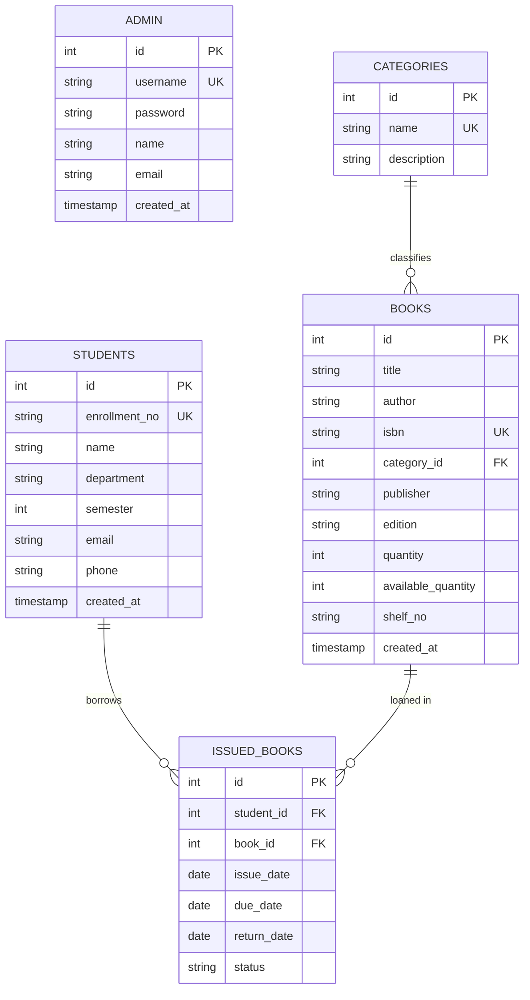

# Database Design: Smart Library Management System

## 1. Database Overview

* **Database Name**: `library_management`
* **RDBMS**: MySQL 8.0+
* **Character Set**: `utf8mb4`
* **Collation**: `utf8mb4_unicode_ci`
* **Storage Engine**: InnoDB (ACID compliant with Foreign Key and Transaction support)

---

## 2. Entity-Relationship (ER) Diagram

---

## 3. Table Schemas & Constraints

### 3.1. `admin`
Stores system administrator credentials.

| Column | Data Type | Nullable | Key / Constraints | Description |
| :--- | :--- | :--- | :--- | :--- |
| `id` | `INT` | No | `PRIMARY KEY AUTO_INCREMENT` | Unique Admin ID |
| `username` | `VARCHAR(50)` | No | `UNIQUE` | Admin login handle |
| `password` | `VARCHAR(255)` | No | | Admin login password |
| `name` | `VARCHAR(100)` | No | | Full name |
| `email` | `VARCHAR(100)` | Yes | | Contact email address |
| `created_at` | `TIMESTAMP` | No | `DEFAULT CURRENT_TIMESTAMP` | Registration date |

---

### 3.2. `categories`
Stores book categories and subject classifications.

| Column | Data Type | Nullable | Key / Constraints | Description |
| :--- | :--- | :--- | :--- | :--- |
| `id` | `INT` | No | `PRIMARY KEY AUTO_INCREMENT` | Unique Category ID |
| `name` | `VARCHAR(100)` | No | `UNIQUE` | Unique Category Name |
| `description` | `VARCHAR(255)` | Yes | | Subject description |

---

### 3.3. `books`
Stores physical book catalog, inventory counts, and shelf locations.

| Column | Data Type | Nullable | Key / Constraints | Description |
| :--- | :--- | :--- | :--- | :--- |
| `id` | `INT` | No | `PRIMARY KEY AUTO_INCREMENT` | Unique Book ID |
| `title` | `VARCHAR(200)` | No | `INDEX` | Title of the book |
| `author` | `VARCHAR(150)` | No | `INDEX` | Author name(s) |
| `isbn` | `VARCHAR(50)` | No | `UNIQUE` | Unique ISBN number |
| `category_id` | `INT` | No | `FOREIGN KEY REFERENCES categories(id)` | Category reference |
| `publisher` | `VARCHAR(150)` | Yes | | Publishing house |
| `edition` | `VARCHAR(50)` | Yes | | Book edition |
| `quantity` | `INT` | No | `CHECK (quantity >= 0)` | Total physical copies |
| `available_quantity`| `INT` | No | `CHECK (available_quantity >= 0 AND <= quantity)` | Available copies |
| `shelf_no` | `VARCHAR(50)` | Yes | | Physical shelf placement |
| `created_at` | `TIMESTAMP` | No | `DEFAULT CURRENT_TIMESTAMP` | Cataloging timestamp |

* **Foreign Key**: `category_id` references `categories(id)` with `ON DELETE RESTRICT ON UPDATE CASCADE`.

---

### 3.4. `students`
Stores registered college student details.

| Column | Data Type | Nullable | Key / Constraints | Description |
| :--- | :--- | :--- | :--- | :--- |
| `id` | `INT` | No | `PRIMARY KEY AUTO_INCREMENT` | Unique Student ID |
| `enrollment_no` | `VARCHAR(50)` | No | `UNIQUE` | College enrollment number |
| `name` | `VARCHAR(150)` | No | `INDEX` | Student full name |
| `department` | `VARCHAR(100)` | Yes | `INDEX` | Engineering / Academic branch |
| `semester` | `INT` | Yes | `CHECK (semester BETWEEN 1 AND 8)`| Academic semester |
| `email` | `VARCHAR(100)` | Yes | | Student email address |
| `phone` | `VARCHAR(20)` | Yes | | Contact phone number |
| `created_at` | `TIMESTAMP` | No | `DEFAULT CURRENT_TIMESTAMP` | Registration timestamp |

---

### 3.5. `issued_books`
Stores book loan transactions and return statuses.

> [!NOTE]
> In accordance with project requirements, **NO fine management or overdue fee calculation** is present.

| Column | Data Type | Nullable | Key / Constraints | Description |
| :--- | :--- | :--- | :--- | :--- |
| `id` | `INT` | No | `PRIMARY KEY AUTO_INCREMENT` | Unique Transaction ID |
| `student_id` | `INT` | No | `FOREIGN KEY REFERENCES students(id)` | Borrowing Student ID |
| `book_id` | `INT` | No | `FOREIGN KEY REFERENCES books(id)` | Borrowed Book ID |
| `issue_date` | `DATE` | No | | Date borrowed |
| `due_date` | `DATE` | No | | Return due date |
| `return_date` | `DATE` | Yes | | Actual return date (NULL while issued) |
| `status` | `VARCHAR(20)` | No | `CHECK (status IN ('ISSUED', 'RETURNED'))` | Transaction status |

* **Foreign Keys**:
  - `student_id` references `students(id)` with `ON DELETE CASCADE ON UPDATE CASCADE`.
  - `book_id` references `books(id)` with `ON DELETE CASCADE ON UPDATE CASCADE`.

---

## 4. CRUD to SQL Mapping

| Operation | Entity | DAO Method | SQL Query Pattern |
| :--- | :--- | :--- | :--- |
| **CREATE** | Category | `CategoryDAO.addCategory` | `INSERT INTO categories (name, description) VALUES (?, ?)` |
| **READ** | Category | `CategoryDAO.getAllCategories` | `SELECT id, name, description FROM categories ORDER BY name ASC` |
| **READ** | Category | `CategoryDAO.getCategoryById` | `SELECT id, name, description FROM categories WHERE id = ?` |
| **UPDATE** | Category | `CategoryDAO.updateCategory` | `UPDATE categories SET name = ?, description = ? WHERE id = ?` |
| **DELETE** | Category | `CategoryDAO.deleteCategory` | `DELETE FROM categories WHERE id = ?` |
| **CREATE** | Book | `BookDAO.addBook` | `INSERT INTO books (title, author, isbn, category_id, publisher, edition, quantity, available_quantity, shelf_no) VALUES (?, ?, ?, ?, ?, ?, ?, ?, ?)` |
| **READ** | Book | `BookDAO.getAllBooks` | `SELECT b.*, c.name AS category_name FROM books b LEFT JOIN categories c ON b.category_id = c.id ORDER BY b.id DESC` |
| **READ** | Book | `BookDAO.getBookById` | `SELECT b.*, c.name AS category_name FROM books b LEFT JOIN categories c ON b.category_id = c.id WHERE b.id = ?` |
| **READ (Search)**| Book | `BookDAO.searchBooks` | `SELECT b.*, c.name AS category_name FROM books b LEFT JOIN categories c ON b.category_id = c.id WHERE LOWER(b.title) LIKE ? OR ...` |
| **UPDATE** | Book | `BookDAO.updateBook` | `UPDATE books SET title=?, author=?, isbn=?, category_id=?, publisher=?, edition=?, quantity=?, available_quantity=?, shelf_no=? WHERE id=?` |
| **DELETE** | Book | `BookDAO.deleteBook` | `DELETE FROM books WHERE id = ?` |
| **CREATE** | Student | `StudentDAO.addStudent` | `INSERT INTO students (enrollment_no, name, department, semester, email, phone) VALUES (?, ?, ?, ?, ?, ?)` |
| **READ** | Student | `StudentDAO.getAllStudents`| `SELECT * FROM students ORDER BY id DESC` |
| **READ** | Student | `StudentDAO.getStudentById`| `SELECT * FROM students WHERE id = ?` |
| **READ (Search)**| Student | `StudentDAO.searchStudents`| `SELECT * FROM students WHERE LOWER(enrollment_no) LIKE ? OR LOWER(name) LIKE ? ...` |
| **UPDATE** | Student | `StudentDAO.updateStudent` | `UPDATE students SET enrollment_no=?, name=?, department=?, semester=?, email=?, phone=? WHERE id=?` |
| **CREATE (Auth)**| Admin | `AdminDAO.register` | `INSERT INTO admin (username, password, name, email) VALUES (?, ?, ?, ?)` |
| **READ (Auth)** | Admin | `AdminDAO.authenticate` | `SELECT id, username, password, name, email FROM admin WHERE LOWER(username)=LOWER(?) AND password=?` |
| **READ (Auth)** | Admin | `AdminDAO.isUsernameExists` | `SELECT COUNT(*) FROM admin WHERE LOWER(TRIM(username)) = LOWER(TRIM(?))` |
| **TRANSACTION** | IssuedBook | `IssuedBookDAO.issueBook` | 1. Lock Book: `SELECT available_quantity FROM books WHERE id = ? FOR UPDATE` 2. Insert Issue: `INSERT INTO issued_books (...) VALUES (...)` 3. Deduct Stock: `UPDATE books SET available_quantity = available_quantity - 1 WHERE id = ?` |
| **TRANSACTION** | IssuedBook | `IssuedBookDAO.returnBook`| 1. Lock Issue: `SELECT book_id, status FROM issued_books WHERE id = ? FOR UPDATE` 2. Update Status: `UPDATE issued_books SET return_date = ?, status = 'RETURNED' WHERE id = ?` 3. Restore Stock: `UPDATE books SET available_quantity = available_quantity + 1 WHERE id = ?` |
